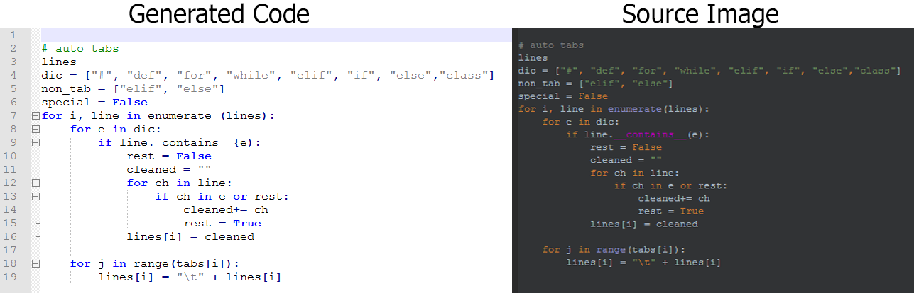

# IMAGE_2_CODE
        Convert images of python code into formatted python code.
        Uses Neural LSTM Engine technology.

## Rquirements/dependencies: 
### To run this code, you need the following packages:
* Tesseract-OCR --> download from this [**Link**](https://tesseract-ocr.github.io/tessdoc/4.0-with-LSTM.html#400-alpha-for-windows) or if running on windows download the binaries from the [**tesseract_exe**](https://github.com/mhamdan91/IMAGE_2_CODE/tree/master/tesseract_exe) folder.
* pytesseract.
* numpy.
* matplotlib.
* open-cv (cv2).

## Tesseract Installation
    1- Install pytesseract, e.g. using pip --> **pip install pytesseract**
    2- Install Tesseract-OCR .exe to the following location on your machine: C:\Users\your_username\AppData\Roaming 
------------------------------------

### Main.py Arguments:
    1. '-i', '--input_path', default='input\code.png', type=str, help='Directory to input images or path to input image -- default: input\code.png'
    2. '-o', '--output_path', default='output', type=str, help=' Path to output directory where generated code will be saved -- default: output'
    3. '-b', '--bg', default=False, type=bool, help=' Employ background processing along with Neural LSTM engine. -- default: False'
    4. '-g', '--gamma', default=False, type=bool, help=' Adjust input image gamma level -- default: False'

## Simple Use [this will convert all files in the "input" directory]
    python main.py -i input -o output

    

------------------------------------------
### Created by: Muhammad Hamdan	 
